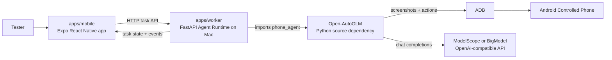

# Phone Automation Agent

[English](./README.md) | [中文](./README.zh-CN.md)

Internal demo app for mobile-first phone automation. A tester submits a task
from an Android app, a Mac-hosted Agent Runtime controls the same phone through
ADB and [Open-AutoGLM](https://github.com/zai-org/Open-AutoGLM), then the app
shows the final task state and evidence.

The project is demo-stage. The validated route is Android + Expo + Mac worker +
Open-AutoGLM + ModelScope `ZhipuAI/AutoGLM-Phone-9B`.

## Status

- Validated: app-submitted end-to-end run on 2026-06-10.
- Target: internal testing only.
- Distribution: no app store release yet.
- Automation engine: upstream Open-AutoGLM, wrapped by a thin worker adapter.
- Primary product surface: `apps/mobile`. `apps/web` is auxiliary.

## Features

- Android Mobile Agent App built with Expo React Native.
- FastAPI worker that exposes task, device, and event endpoints.
- Open-AutoGLM runner mode that imports `phone_agent` and calls
  `PhoneAgent.step()` inside the worker process.
- ADB device discovery and single-active-task protection.
- Normalized task events for mobile progress and result review.
- Explicit setup failures for missing model keys, missing devices, missing
  Open-AutoGLM source, and unsupported manual gates.

## Demo Story

The first acceptance story is:

```text
打开美团搜索附近的火锅店，不要下单，只停在搜索结果页
```

Passing signs:

- The app shows `Worker Online`.
- The app lists at least one available Android device.
- The submitted task reaches `finished`.
- Meituan is left on the nearby hotpot search results page.

## Architecture

The first demo is a Single-Phone Demo: the same Android phone runs the Mobile
Agent App and is also the Controlled Phone operated by Open-AutoGLM.



The worker does not start an Open-AutoGLM service. It imports `phone_agent`,
configures the model and agent, then calls `PhoneAgent.step()` for each task
step.

## Repository Layout

```text
apps/
  mobile/   Expo React Native Android app
  worker/   Python FastAPI Agent Runtime
  web/      Auxiliary web surface for future landing/download/management work
docs/       Durable product and architecture notes
packages/   Shared monorepo packages inherited from the template
```

## Quick Start

### 1. Install repo dependencies

```bash
git clone <this-repo-url> phone-automation-agent
cd phone-automation-agent
corepack enable
pnpm install
```

### 2. Provide Open-AutoGLM source

The minimum reproducible setup is a sibling checkout. The root worker scripts
default `OPEN_AUTOGLM_ROOT` to `../Open-AutoGLM`.

```bash
cd ..
git clone https://github.com/zai-org/Open-AutoGLM.git Open-AutoGLM
cd Open-AutoGLM
git checkout 86f55382982fb054e8fc98ca80609dff8a2cdc3c
cd ../phone-automation-agent
```

You can skip `OPEN_AUTOGLM_ROOT` only if `phone_agent` is already importable from
the Python environment that runs `apps/worker`.

### 3. Configure model credentials

Create `.env` from the example, then replace the API key.

```bash
cp .env.example .env
```

Current validated route:

```bash
PHONE_AGENT_BASE_URL="https://api-inference.modelscope.cn/v1"
PHONE_AGENT_MODEL="ZhipuAI/AutoGLM-Phone-9B"
PHONE_AGENT_API_KEY="<your-modelscope-token>"
```

Historical BigModel route:

```bash
PHONE_AGENT_BASE_URL="https://open.bigmodel.cn/api/paas/v4"
PHONE_AGENT_MODEL="autoglm-phone"
PHONE_AGENT_API_KEY="<your-bigmodel-token>"
```

BigModel proved the original raw Open-AutoGLM quickstart. The current
app-submitted route was most recently verified with ModelScope, so use
ModelScope first when reproducing the demo.

### 4. Run the mobile app and worker

Connect the Android phone and verify ADB sees it:

```bash
adb devices -l
```

For the USB route, reverse Metro and worker ports:

```bash
adb reverse tcp:8081 tcp:8081
adb reverse tcp:8765 tcp:8765
```

Terminal 1:

```bash
pnpm dev:mobile -- --host localhost --port 8081
```

Open the Android app from the Expo prompt, usually by pressing `a`.

Terminal 2:

```bash
trap 'adb shell wm size reset >/dev/null 2>&1' EXIT
adb shell wm size 992x2048
pnpm dev:worker:open-autoglm
```

In the Mobile Agent App:

1. Set Worker URL to `http://127.0.0.1:8765`.
2. Tap `Check Worker`.
3. Confirm `Worker Online` and an available device.
4. Tap `Submit From Phone`.
5. Wait for `finished`.

Restore check after the run:

```bash
adb shell wm size
```

## Configuration

Root `.env` values used by the worker:

| Variable                         | Purpose                                                         |
| -------------------------------- | --------------------------------------------------------------- |
| `PHONE_AUTOMATION_WORKER_RUNNER` | `open-autoglm`, `dry-run`, or `unconfigured`                    |
| `PHONE_AUTOMATION_WORKER_HOST`   | Worker bind host, defaults to `127.0.0.1`                       |
| `PHONE_AUTOMATION_WORKER_PORT`   | Worker port, defaults to `8765`                                 |
| `OPEN_AUTOGLM_ROOT`              | Local Open-AutoGLM checkout when `phone_agent` is not installed |
| `PHONE_AGENT_BASE_URL`           | OpenAI-compatible model API base URL                            |
| `PHONE_AGENT_MODEL`              | Model name, for example `ZhipuAI/AutoGLM-Phone-9B`              |
| `PHONE_AGENT_API_KEY`            | Model provider API key                                          |
| `PHONE_AGENT_MAX_STEPS`          | Max Open-AutoGLM steps, defaults to `12`                        |

For a real phone on the same Wi-Fi network, use:

```bash
pnpm dev:worker:open-autoglm:lan
```

Then set the app Worker URL to `http://<mac-lan-ip>:8765`. Use LAN mode only on
a trusted local network.

## Development

Run all tests and type checks:

```bash
pnpm test
pnpm typecheck
```

Worker-only:

```bash
pnpm --dir apps/worker test
pnpm --dir apps/worker typecheck
```

Mobile-only:

```bash
pnpm --dir apps/mobile test
pnpm --dir apps/mobile typecheck
```

Endpoint smoke test without controlling a phone:

```bash
pnpm dev:worker:dry-run
```

In another terminal:

```bash
curl -sS http://127.0.0.1:8765/healthz
curl -sS http://127.0.0.1:8765/devices
curl -sS -X POST http://127.0.0.1:8765/tasks \
  -H 'Content-Type: application/json' \
  -d '{"instruction":"打开美团搜索附近的火锅店，不要下单，只停在搜索结果页","source":"mobile"}'
```

## Upstream Quickstart

Open-AutoGLM's own `.venv` is optional for this repo. Set it up only when you
want to reproduce the raw upstream quickstart outside the monorepo:

```bash
cd ../Open-AutoGLM
uv venv --python 3.12
uv pip install --python .venv/bin/python -r requirements.txt
uv pip install --python .venv/bin/python -e .
cd ../phone-automation-agent
```

The tested upstream commit was:

```text
86f55382982fb054e8fc98ca80609dff8a2cdc3c
```

## Safety Notes

- Use low-risk search-only tasks for the demo.
- Do not test checkout, payment, messaging, login, captcha, or verification-code
  workflows.
- Keep model provider secrets in `.env`; do not print or commit them.
- Use LAN worker mode only on a trusted local network.

## Documentation

- `CONTEXT.md`: shared product language.
- `docs/index.md`: durable docs map.
- `docs/product/first-demo-story.md`: acceptance QA story and passing route.
- `docs/architecture/worker-api.md`: worker endpoints and runtime modes.
- `docs/architecture/open-autoglm-integration.md`: integration boundary with
  Open-AutoGLM.

Keep QA screenshots and recordings in an OS temp directory by default. Copy
artifacts into the repo only when they are needed for durable review.

## Contributing

No formal `CONTRIBUTING.md` exists yet. For now:

- Read `docs/index.md` and `CONTEXT.md` before changing architecture or product
  language.
- Keep Open-AutoGLM integration thin until a real demo blocker requires a deeper
  change.
- Use `pnpm` for the monorepo and `uv` for Python work.
- Run the relevant tests and type checks before handing off changes.
- Do not commit `.env`, API keys, device recordings, or temporary QA artifacts.

## Upstream Attribution

This project is built on
[zai-org/Open-AutoGLM](https://github.com/zai-org/Open-AutoGLM). The current
repo uses the existing Android ADB control loop through a small worker adapter
so the first demo can stay close to the proven upstream quickstart path.

## License

Licensed under the [Apache License 2.0](./LICENSE). Open-AutoGLM is also
Apache-2.0, and remains governed by its own upstream license.
