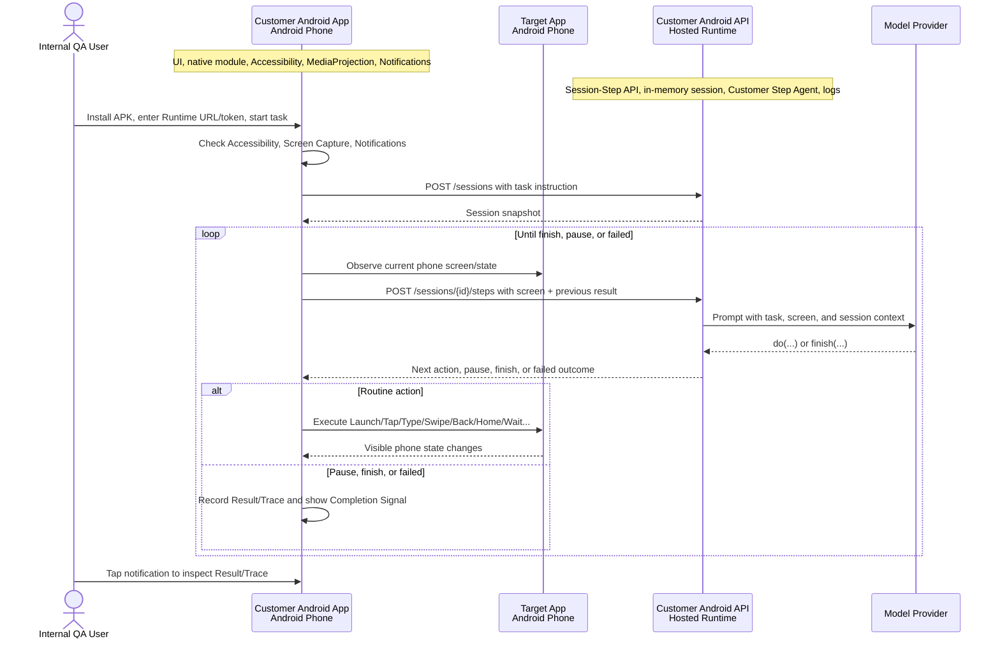

# Phone Automation Agent

[English](./README.md) | [中文](./README.zh-CN.md)

Customer Android phone automation MVP. The current product route is an
installable Android APK in `apps/customer-android` paired with a hosted
FastAPI runtime in `apps/customer-android-api`.

The APK owns the phone side: task entry, permission onboarding, screen capture,
Accessibility-based routine actions, pause controls, completion notifications,
and result evidence. The API owns the agent side: sessions, Open-AutoGLM-style
prompting and action parsing, model-provider calls, logs, and normalized
failure states.

This repository is in internal alpha. The goal is to prove the Customer App
Story through sideloaded APKs and a hosted runtime. There is no Play Store,
AAB, public beta, or production support path yet.

## Current Status

- Current focus: `apps/customer-android` plus `apps/customer-android-api`.
- Latest internal APK: `customer-phone-agent-0.1.0-alpha.8.apk`.
- Validated: scripted action QA on a physical Android phone on 2026-06-15.
- Pending: real-provider customer-story QA from the downloadable alpha APK,
  tracked in [#17](https://github.com/SawanaLabs/phone-automation-agent/issues/17).
- Model route for real QA: BigModel `autoglm-phone` through the
  OpenAI-compatible provider preset.

## Latest Alpha APK

- Release: [Customer Phone Agent 0.1.0-alpha.8](https://github.com/SawanaLabs/phone-automation-agent/releases/tag/customer-phone-agent-0.1.0-alpha.8)
- APK: [customer-phone-agent-0.1.0-alpha.8.apk](https://github.com/SawanaLabs/phone-automation-agent/releases/download/customer-phone-agent-0.1.0-alpha.8/customer-phone-agent-0.1.0-alpha.8.apk)
- Android version code: `8`
- Commit: `af084de217113f9e6c2a7a99011768af50c4d2fb`
- SHA-256:
  `559b3771d03e810680b0f14dd626b9e1b90e815b2ba434c8544246b31f0c23da`

Alpha APKs are sideload artifacts for internal QA. Install them on a physical
Android phone. A release APK does not need Metro.

## Customer Story

The first customer-story target is:

```text
打开小红书，搜索咖啡店，然后停一下
```

Acceptance signs:

- The user starts from the installed Customer Android APK.
- The app connects to `apps/customer-android-api` through a Runtime URL and
  Runtime Access Token.
- The user grants Accessibility Service, Screen Capture, and Notifications.
- The same phone running the APK is observed and controlled.
- The task stops on the target app result page or reaches a clear pause/failure
  state with Result and Trace evidence.
- The user receives a Completion Signal notification and can tap it to return
  to the app evidence.

## Architecture



`apps/customer-android-api` exposes:

- `GET /healthz`
- `POST /sessions`
- `GET /sessions/{session_id}`
- `POST /sessions/{session_id}/steps`

Authenticated routes require `Authorization: Bearer <CUSTOMER_ANDROID_API_ACCESS_TOKEN>`.

## Run The Customer Android API

Install repo dependencies:

```bash
corepack enable
pnpm install
```

Create `.env` or `.env.local` with an alpha runtime token:

```bash
CUSTOMER_ANDROID_API_ACCESS_TOKEN="dev-alpha-token"
```

Start the API for a phone on the same LAN:

```bash
pnpm dev:customer-android-api:lan
```

The API listens on port `8787` by default. In the APK, use:

```text
http://<mac-lan-ip>:8787
```

### Scripted QA Mode

Scripted mode is the default. It is useful for transport, permission, executor,
notification, and error-evidence checks without model calls.

Optional scripted sequence:

```bash
CUSTOMER_ANDROID_MODEL_PROVIDER="scripted"
CUSTOMER_ANDROID_SCRIPTED_ACTIONS_JSON='["do(action=\"Launch\", app=\"com.android.settings\")","do(action=\"Wait\", duration=\"1 seconds\")","finish(message=\"done\")"]'
```

### Real Provider Mode

For BigModel `autoglm-phone`:

```bash
CUSTOMER_ANDROID_MODEL_PROVIDER="openai-compatible"
CUSTOMER_ANDROID_MODEL_ENDPOINT="bigmodel"
BIGMODEL_TOKEN="<your-bigmodel-token>"
```

Custom OpenAI-compatible endpoints can use:

```bash
CUSTOMER_ANDROID_MODEL_BASE_URL="<base-url>"
CUSTOMER_ANDROID_MODEL_API_KEY="<api-key>"
CUSTOMER_ANDROID_MODEL_NAME="<model-name>"
```

Leave `CUSTOMER_ANDROID_MODEL_ENDPOINT` unset when using custom endpoint values.

## Use The APK

1. Download the latest alpha APK from GitHub Releases.
2. Install it on a physical Android phone.
3. Open `Customer Phone Agent`.
4. Enter the Runtime URL, for example `http://<mac-lan-ip>:8787`.
5. Enter the Runtime Access Token from `CUSTOMER_ANDROID_API_ACCESS_TOKEN`.
6. Grant Accessibility Service, Screen Capture, and Notifications.
7. Start a bounded search task.
8. Use Result, Trace, Android notification, API logs, and
   `adb logcat -s CustomerAutomation` as QA evidence.

Do not use alpha builds for payment, checkout, messaging, login, captcha,
verification-code, or irreversible account actions.

## Development

Customer Android API:

```bash
pnpm --dir apps/customer-android-api test
pnpm --dir apps/customer-android-api typecheck
pnpm dev:customer-android-api
```

Customer Android app:

```bash
pnpm --dir apps/customer-android test
pnpm --dir apps/customer-android typecheck
pnpm --dir apps/customer-android lint
```

Android release builds require JDK 17. See
[`apps/customer-android/README.md`](./apps/customer-android/README.md) for
keystore, Gradle, and alpha-release details.

## Repository Layout

```text
apps/
  customer-android/      Customer-facing Android APK
  customer-android-api/  Hosted FastAPI Agent Runtime
  mobile/                Legacy worker-backed demo companion
  worker/                Legacy Mac/ADB worker runtime
  web/                   Auxiliary web surface
docs/
  customer-android/      Current customer app/API domain docs
  product/               Product stories and boundaries
  architecture/          Runtime and integration boundaries
  planning/              Roadmap and grooming outputs
```

## Documentation

Start here:

- [`docs/index.md`](./docs/index.md): documentation map.
- [`docs/customer-android/DOCS.md`](./docs/customer-android/DOCS.md): Customer Android domain protocol.
- [`docs/customer-android/runtime-contract.md`](./docs/customer-android/runtime-contract.md): Session-Step API contract.
- [`docs/customer-android/agent-engine.md`](./docs/customer-android/agent-engine.md): API runtime and model-provider contract.
- [`docs/customer-android/action-handling.md`](./docs/customer-android/action-handling.md): Open-AutoGLM action vocabulary handling.
- [`docs/customer-android/evidence-first-e2e.md`](./docs/customer-android/evidence-first-e2e.md): connected-device QA checklist.
- [`docs/customer-android/delivery.md`](./docs/customer-android/delivery.md): alpha APK distribution rules.

## Legacy Demo Surfaces

`apps/mobile` and `apps/worker` remain in the repo as the earlier Mac/ADB demo
path. They are no longer the README's primary route. Use the Customer Android
docs when working toward the installable customer APK story.

## Contributing

- Read `docs/index.md` and the relevant `docs/customer-android/*` file before
  changing customer app architecture or product language.
- Keep provider secrets in local env files. Do not commit `.env`, API keys,
  release keystores, device recordings, or temporary QA artifacts.
- Use `pnpm` for the monorepo and `uv` for Python work.
- Run the focused tests for the app or API before handing off changes.

## Upstream Attribution

This project uses [zai-org/Open-AutoGLM](https://github.com/zai-org/Open-AutoGLM)
as the behavior reference for prompt shape, model output format, and action
vocabulary.

## License

Licensed under the [Apache License 2.0](./LICENSE). Open-AutoGLM is also
Apache-2.0 and remains governed by its upstream license.
