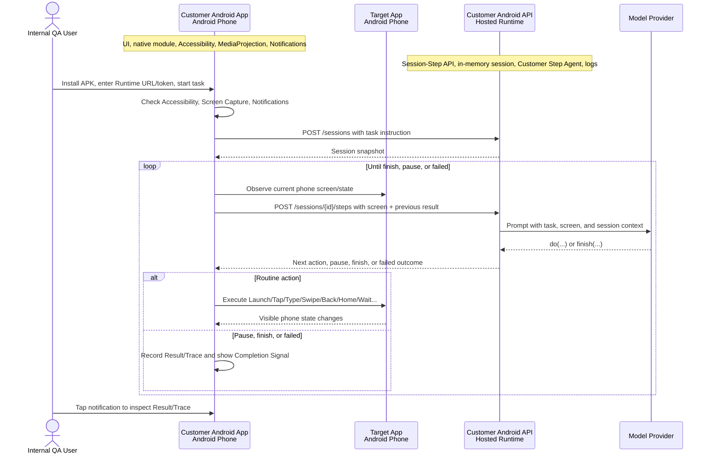

# Phone Automation Agent

[English](./README.md) | [中文](./README.zh-CN.md)

Customer Android 手机自动化 MVP。当前产品路线是 `apps/customer-android` 中的可安装
Android APK，搭配 `apps/customer-android-api` 中的 hosted FastAPI runtime。

APK 负责手机侧能力：任务输入、权限引导、屏幕捕获、基于 Accessibility 的常规动作执行、暂停控制、
完成通知和结果证据。API 负责 agent 侧能力：任务 session、Open-AutoGLM 风格 prompt 和
action parsing、模型调用、运行日志和规范化失败状态。

这个仓库目前处于内部 alpha。目标是通过 sideload APK 和 hosted runtime 证明 Customer App Story。
当前没有 Play Store、AAB、公开 beta 或生产支持路线。

## 当前状态

- 当前重点：`apps/customer-android` 加 `apps/customer-android-api`。
- 最新内测 APK：`customer-phone-agent-0.1.0-alpha.8.apk`。
- 已验证：2026-06-15 在真实 Android 手机上通过 scripted action QA。
- 待验证：从可下载 alpha APK 开始的 real-provider customer-story QA，记录在
  [#17](https://github.com/SawanaLabs/phone-automation-agent/issues/17)。
- 真实 QA 的模型路线：BigModel `autoglm-phone`，通过 OpenAI-compatible provider preset。

## 最新 Alpha APK

- Release: [Customer Phone Agent 0.1.0-alpha.8](https://github.com/SawanaLabs/phone-automation-agent/releases/tag/customer-phone-agent-0.1.0-alpha.8)
- APK: [customer-phone-agent-0.1.0-alpha.8.apk](https://github.com/SawanaLabs/phone-automation-agent/releases/download/customer-phone-agent-0.1.0-alpha.8/customer-phone-agent-0.1.0-alpha.8.apk)
- Android version code: `8`
- Commit: `af084de217113f9e6c2a7a99011768af50c4d2fb`
- SHA-256:
  `559b3771d03e810680b0f14dd626b9e1b90e815b2ba434c8544246b31f0c23da`

Alpha APK 是内部 QA 使用的 sideload artifact。把 APK 安装到真实 Android 手机上。release APK
不需要 Metro。

## Customer Story

第一条 customer-story 目标是：

```text
打开小红书，搜索咖啡店，然后停一下
```

通过信号：

- 用户从已安装的 Customer Android APK 开始。
- App 通过 Runtime URL 和 Runtime Access Token 连接到 `apps/customer-android-api`。
- 用户授予 Accessibility Service、Screen Capture 和 Notifications。
- 运行 APK 的同一台手机被观察和控制。
- 任务停在目标 app 的结果页，或进入清晰的暂停/失败状态，并有 Result 和 Trace 证据。
- 用户收到 Completion Signal notification，点击后能回到 App 查看证据。

## 架构



`apps/customer-android-api` 暴露：

- `GET /healthz`
- `POST /sessions`
- `GET /sessions/{session_id}`
- `POST /sessions/{session_id}/steps`

需要鉴权的 route 使用 `Authorization: Bearer <CUSTOMER_ANDROID_API_ACCESS_TOKEN>`。

## 启动 Customer Android API

安装仓库依赖：

```bash
corepack enable
pnpm install
```

在 `.env` 或 `.env.local` 中配置 alpha runtime token：

```bash
CUSTOMER_ANDROID_API_ACCESS_TOKEN="dev-alpha-token"
```

为同一局域网内的手机启动 API：

```bash
pnpm dev:customer-android-api:lan
```

API 默认监听 `8787` 端口。在 APK 里填写：

```text
http://<mac-lan-ip>:8787
```

### Scripted QA 模式

scripted 模式是默认模式。它适合验证传输、权限、执行器、通知和错误证据，不消耗模型调用。

可选 scripted sequence：

```bash
CUSTOMER_ANDROID_MODEL_PROVIDER="scripted"
CUSTOMER_ANDROID_SCRIPTED_ACTIONS_JSON='["do(action=\"Launch\", app=\"com.android.settings\")","do(action=\"Wait\", duration=\"1 seconds\")","finish(message=\"done\")"]'
```

### 真实模型模式

BigModel `autoglm-phone`：

```bash
CUSTOMER_ANDROID_MODEL_PROVIDER="openai-compatible"
CUSTOMER_ANDROID_MODEL_ENDPOINT="bigmodel"
BIGMODEL_TOKEN="<your-bigmodel-token>"
```

自定义 OpenAI-compatible endpoint：

```bash
CUSTOMER_ANDROID_MODEL_BASE_URL="<base-url>"
CUSTOMER_ANDROID_MODEL_API_KEY="<api-key>"
CUSTOMER_ANDROID_MODEL_NAME="<model-name>"
```

使用自定义 endpoint 时，保持 `CUSTOMER_ANDROID_MODEL_ENDPOINT` 未设置。

## 使用 APK

1. 从 GitHub Releases 下载最新 alpha APK。
2. 安装到真实 Android 手机。
3. 打开 `Customer Phone Agent`。
4. 输入 Runtime URL，例如 `http://<mac-lan-ip>:8787`。
5. 输入 `CUSTOMER_ANDROID_API_ACCESS_TOKEN` 对应的 Runtime Access Token。
6. 授予 Accessibility Service、Screen Capture 和 Notifications。
7. 启动一个有边界的搜索任务。
8. 用 Result、Trace、Android notification、API logs 和
   `adb logcat -s CustomerAutomation` 作为 QA 证据。

不要用 alpha build 测试支付、下单、发消息、登录、captcha、验证码或不可逆账号操作。

## 开发

Customer Android API：

```bash
pnpm --dir apps/customer-android-api test
pnpm --dir apps/customer-android-api typecheck
pnpm dev:customer-android-api
```

Customer Android app：

```bash
pnpm --dir apps/customer-android test
pnpm --dir apps/customer-android typecheck
pnpm --dir apps/customer-android lint
```

Android release build 需要 JDK 17。keystore、Gradle 和 alpha release 细节见
[`apps/customer-android/README.md`](./apps/customer-android/README.md)。

## 仓库结构

```text
apps/
  customer-android/      面向客户的 Android APK
  customer-android-api/  Hosted FastAPI Agent Runtime
  mobile/                旧 worker-backed demo companion
  worker/                旧 Mac/ADB worker runtime
  web/                   辅助 Web 表面
docs/
  customer-android/      当前 customer app/API 领域文档
  product/               产品 story 和边界
  architecture/          runtime 和集成边界
  planning/              roadmap 和 grooming 输出
```

## 文档

从这些文档开始：

- [`docs/index.md`](./docs/index.md)：文档地图。
- [`docs/customer-android/DOCS.md`](./docs/customer-android/DOCS.md)：Customer Android 领域协议。
- [`docs/customer-android/runtime-contract.md`](./docs/customer-android/runtime-contract.md)：Session-Step API contract。
- [`docs/customer-android/agent-engine.md`](./docs/customer-android/agent-engine.md)：API runtime 和 model-provider contract。
- [`docs/customer-android/action-handling.md`](./docs/customer-android/action-handling.md)：Open-AutoGLM action vocabulary handling。
- [`docs/customer-android/evidence-first-e2e.md`](./docs/customer-android/evidence-first-e2e.md)：真机 QA checklist。
- [`docs/customer-android/delivery.md`](./docs/customer-android/delivery.md)：alpha APK 分发规则。

## Legacy Demo Surfaces

`apps/mobile` 和 `apps/worker` 仍保留在仓库中，代表更早的 Mac/ADB demo 路线。根 README
当前主线是 Customer Android。推进可安装 customer APK story 时，使用 Customer Android 文档。

## 贡献

- 修改 customer app 架构或产品语言前，先读 `docs/index.md` 和相关 `docs/customer-android/*` 文件。
- provider secrets 放在本地 env 文件中。不要提交 `.env`、API key、release keystore、设备录屏或临时
  QA artifact。
- monorepo 使用 `pnpm`，Python 工作使用 `uv`。
- 交接前运行 app 或 API 的聚焦测试。

## 上游致谢

本项目使用 [zai-org/Open-AutoGLM](https://github.com/zai-org/Open-AutoGLM)
作为 prompt shape、模型输出格式和 action vocabulary 的行为参考。

## 许可证

本仓库使用 [Apache License 2.0](./LICENSE)。Open-AutoGLM 同样使用 Apache-2.0，并继续遵循它自己的
upstream license。
