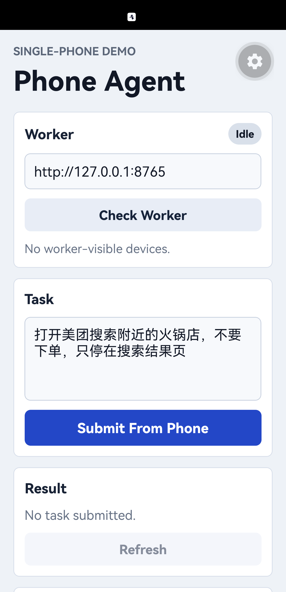
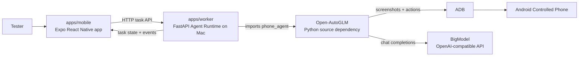

# Phone Automation Agent

[English](./README.md) | [中文](./README.zh-CN.md)

用于验证移动端优先手机自动化的内测 demo 应用。测试者从 Android App 提交任务，Mac 上的
Agent Runtime 通过 ADB 和 [Open-AutoGLM](https://github.com/zai-org/Open-AutoGLM)
控制同一台手机，然后 App 展示最终任务状态和证据。

项目目前处于 demo 阶段。当前模型端点标准是 BigModel `autoglm-phone`，通过
OpenAI-compatible endpoint preset 配置。

## 截图



## 状态

- 已验证：2026-06-10 通过 App 提交的端到端运行。
- 目标：仅用于内测。
- 分发：还没有应用商店发布版本。
- 自动化引擎：upstream Open-AutoGLM，通过很薄的 worker adapter 封装。
- 主要产品入口：`apps/mobile`。`apps/web` 是辅助表面。

## 功能

- 使用 Expo React Native 构建的 Android Mobile Agent App。
- FastAPI worker，提供任务、设备和事件 endpoint。
- `open-autoglm` runner 模式，在 worker 进程内 import `phone_agent` 并调用
  `PhoneAgent.step()`。
- ADB 设备发现和单活跃任务保护。
- 给移动端进度和结果查看使用的规范化任务事件。
- 对缺少模型 key、缺少设备、缺少 Open-AutoGLM 源码、未支持的人工门控进行明确报错。

## Demo 故事

第一条验收 story 是：

```text
打开美团搜索附近的火锅店，不要下单，只停在搜索结果页
```

通过信号：

- App 显示 `Worker Online`。
- App 列出至少一台可用 Android 设备。
- 提交的任务到达 `finished`。
- 美团停留在附近火锅搜索结果页。

## 架构

第一版 demo 是 Single-Phone Demo：同一台 Android 手机同时运行 Mobile Agent App，也作为
Open-AutoGLM 操作的 Controlled Phone。



worker 不启动 Open-AutoGLM 服务。它 import `phone_agent`，配置 model 和 agent，然后每一步调用
`PhoneAgent.step()`。

## 仓库结构

```text
apps/
  mobile/   Expo React Native Android app
  worker/   Python FastAPI Agent Runtime
  web/      未来 landing/download/management 使用的辅助 Web 表面
docs/       长期产品和架构笔记
packages/   从模板继承的 monorepo 共享包
```

## 快速开始

### 1. 安装仓库依赖

```bash
git clone <this-repo-url> phone-automation-agent
cd phone-automation-agent
corepack enable
pnpm install
```

### 2. 提供 Open-AutoGLM 源码

最低复现路径是 sibling checkout。根目录 worker 脚本默认把 `OPEN_AUTOGLM_ROOT` 指向
`../Open-AutoGLM`。

```bash
cd ..
git clone https://github.com/zai-org/Open-AutoGLM.git Open-AutoGLM
cd Open-AutoGLM
git checkout 86f55382982fb054e8fc98ca80609dff8a2cdc3c
cd ../phone-automation-agent
```

只有当运行 `apps/worker` 的 Python 环境已经能 import `phone_agent` 时，才可以跳过
`OPEN_AUTOGLM_ROOT`。

### 3. 配置模型凭证

从示例创建 `.env`，然后替换 API key。

```bash
cp .env.example .env
```

当前 BigModel 路线：

```bash
BIGMODEL_TOKEN="<your-bigmodel-token>"
PHONE_AGENT_ENDPOINT="bigmodel"
```

endpoint 关键词会在代码里解析成：

```bash
PHONE_AGENT_BASE_URL="https://open.bigmodel.cn/api/paas/v4"
PHONE_AGENT_MODEL="autoglm-phone"
PHONE_AGENT_API_KEY="${BIGMODEL_TOKEN}"
```

历史 ModelScope 路线仍可通过显式配置 `PHONE_AGENT_BASE_URL`、`PHONE_AGENT_MODEL` 和
`PHONE_AGENT_API_KEY` 使用，前提是不要设置 `PHONE_AGENT_ENDPOINT`。

### 4. 运行 mobile app 和 worker

连接 Android 手机，并确认 ADB 能看到设备：

```bash
adb devices -l
```

USB 路线下，反向映射 Metro 和 worker 端口：

```bash
adb reverse tcp:8081 tcp:8081
adb reverse tcp:8765 tcp:8765
```

终端 1：

```bash
pnpm dev:mobile -- --host localhost --port 8081
```

从 Expo prompt 打开 Android App，通常按 `a`。

终端 2：

```bash
trap 'adb shell wm size reset >/dev/null 2>&1' EXIT
adb shell wm size 992x2048
pnpm dev:worker:open-autoglm
```

在 Mobile Agent App 里：

1. 把 Worker URL 设为 `http://127.0.0.1:8765`。
2. 点击 `Check Worker`。
3. 确认 `Worker Online` 和一台可用设备。
4. 点击 `Submit From Phone`。
5. 等待 `finished`。

运行结束后检查恢复状态：

```bash
adb shell wm size
```

## 配置

根目录 `.env` 必填值：

| 变量                   | 用途                                    |
| ---------------------- | --------------------------------------- |
| `BIGMODEL_TOKEN`       | 后端 runtime 使用的 BigModel API token  |
| `PHONE_AGENT_ENDPOINT` | 模型端点关键词，当前使用 `bigmodel`     |

可选 override：

| 变量                           | 用途                                                 |
| ------------------------------ | ---------------------------------------------------- |
| `PHONE_AGENT_BASE_URL`         | 未设置 `PHONE_AGENT_ENDPOINT` 时的自定义端点 base URL |
| `PHONE_AGENT_MODEL`            | 未设置 `PHONE_AGENT_ENDPOINT` 时的自定义模型名        |
| `PHONE_AGENT_API_KEY`          | 未设置 `PHONE_AGENT_ENDPOINT` 时的自定义 API key      |
| `OPEN_AUTOGLM_ROOT`            | `phone_agent` 不可 import 时的 Open-AutoGLM 绝对路径 |
| `PHONE_AGENT_MAX_STEPS`        | 最大 Open-AutoGLM 步数，默认 `12`                    |
| `PHONE_AUTOMATION_WORKER_HOST` | worker bind host，默认 `127.0.0.1`                   |
| `PHONE_AUTOMATION_WORKER_PORT` | worker 端口，默认 `8765`                             |

Runner mode 通常由根目录 package scripts 选择，例如
`pnpm dev:worker:open-autoglm`，不用写进 `.env`。

如果真机和 Mac 在同一个 Wi-Fi 网络，使用：

```bash
pnpm dev:worker:open-autoglm:lan
```

然后把 App 的 Worker URL 设为 `http://<mac-lan-ip>:8765`。LAN 模式只在可信本地网络中使用。

## 开发

运行全部测试和类型检查：

```bash
pnpm test
pnpm typecheck
```

只检查 worker：

```bash
pnpm --dir apps/worker test
pnpm --dir apps/worker typecheck
```

只检查 mobile：

```bash
pnpm --dir apps/mobile test
pnpm --dir apps/mobile typecheck
```

不控制手机的 endpoint smoke test：

```bash
pnpm dev:worker:dry-run
```

另开一个终端：

```bash
curl -sS http://127.0.0.1:8765/healthz
curl -sS http://127.0.0.1:8765/devices
curl -sS -X POST http://127.0.0.1:8765/tasks \
  -H 'Content-Type: application/json' \
  -d '{"instruction":"打开美团搜索附近的火锅店，不要下单，只停在搜索结果页","source":"mobile"}'
```

## 上游 Quickstart

Open-AutoGLM 自己的 `.venv` 对本仓库是可选项。只有你想在 monorepo 外复现 upstream raw
quickstart 时才需要设置：

```bash
cd ../Open-AutoGLM
uv venv --python 3.12
uv pip install --python .venv/bin/python -r requirements.txt
uv pip install --python .venv/bin/python -e .
cd ../phone-automation-agent
```

已验证的 upstream commit：

```text
86f55382982fb054e8fc98ca80609dff8a2cdc3c
```

## 安全说明

- demo 使用低风险的搜索类任务。
- 不测试下单、支付、发消息、登录、验证码或 captcha 流程。
- 模型 provider secrets 保存在 `.env`，不要打印或提交。
- LAN worker 模式只在可信本地网络中使用。

## 文档

- `CONTEXT.md`：共享产品语言。
- `docs/index.md`：长期文档地图。
- `docs/product/first-demo-story.md`：验收 QA story 和已通过路线。
- `docs/architecture/worker-api.md`：worker endpoint 和运行模式。
- `docs/architecture/open-autoglm-integration.md`：与 Open-AutoGLM 的集成边界。

QA 截图和录屏默认放在系统临时目录。只有需要长期 review 时，才把 artifact 复制进仓库。

## 贡献

当前还没有正式的 `CONTRIBUTING.md`。暂时按下面的规则做：

- 改架构或产品语言前，先读 `docs/index.md` 和 `CONTEXT.md`。
- 在真实 demo blocker 出现前，保持 Open-AutoGLM 集成很薄。
- monorepo 使用 `pnpm`，Python 工作使用 `uv`。
- 交接前运行相关测试和类型检查。
- 不提交 `.env`、API key、设备录屏或临时 QA artifact。

## 上游致谢

本项目基于 [zai-org/Open-AutoGLM](https://github.com/zai-org/Open-AutoGLM) 构建。
当前仓库通过一个很薄的 worker adapter 使用现有 Android ADB 控制链路，让第一版 demo
尽量贴近已经验证过的 upstream quickstart 路线。

## 许可证

本仓库使用 [Apache License 2.0](./LICENSE)。Open-AutoGLM 同样使用 Apache-2.0，并继续遵循它自己的
upstream license。
